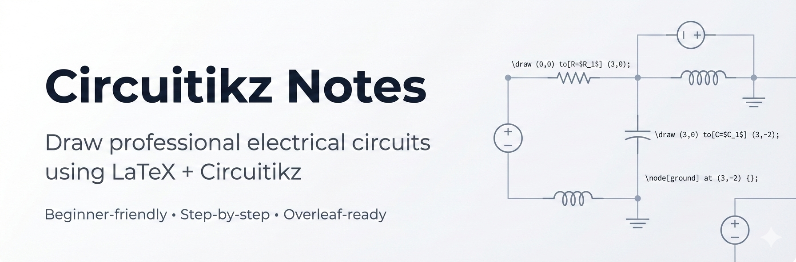

  

# LaTeX Circuit Drawing Notes 📘

This repository contains structured notes for drawing electrical and electronic circuits using LaTeX (`circuitikz`).

---

## 📚 Table of Contents

1. [Lesson-01-Introduction to LaTeX & Circuitikz](introduction.md)
2. [Lesson-02-Basic Circuit Components](basic-components.md)
3. [Lesson 03: Voltage Sources, Grounds, and Nodes](lesson-3.md)
4. [Lesson-04-Series & Parallel Circuits](series-parallel.md)
5. [Lesson-05-Series–Parallel Circuit Examples](lesson-5.md)
