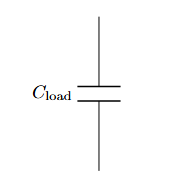
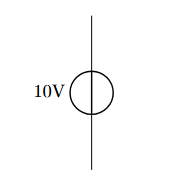

# Lesson-2: Basic Components

## Draw a straight wire from (0,0) to (4,0):
Method-1:  
```latex
\begin{circuitikz}
  \draw (0,0) -- (4,0);
\end{circuitikz}
```

🔍 Explanation:

- -- → draws a plain wire

- (0,0) → starting point

- (4,0) → ending point

Method-2: (Recommended)   
```latex
\begin{circuitikz}
  \draw (0,0) to[short] (4,0);
\end{circuitikz}
```

Output:  

<p align="center">
  
</p>

## Junctions and Nodes
Simple Node (Connection Point):  
Syntax:    
```latex
\draw (2,0) node[circ] {};
```

Wire with a Node:  
Syntax:  
```latex
\draw (0,0) to[short] (2,0) node[circ] {} to[short] (4,0);
```

Example:  
```latex
\documentclass{article}
\usepackage{circuitikz}

\begin{document}

\begin{center}
\begin{circuitikz}

    % Example 1: A simple wire with a junction (node) in the middle
    \draw (0,0) to[short] (2,0) node[circ] {} to[short] (4,0);

    % Example 2: A vertical wire branching down from the node
    \draw (2,0) to[short] (2,-2);

\end{circuitikz}
\end{center}

\end{document}
```
Output:  

<p align="center">
  
</p>

## Draws a resistor horizontally from x=0 to x=3:
Syntax:  
```Latex
\begin{circuitikz}
    \draw (0,0) to[R, l=$R_1$] (3,0);
\end{circuitikz} 
```

Explanation:  
- R: Specifies the component is a Resistor.
- l=`$R_1$`: Adds a label above the component. The `$` signs are used for mathematical formatting (italics, subscripts).  

Example:  
```latex
\documentclass{article} % The type of document

% The Preamble
\usepackage{circuitikz} % We are importing the circuit tool

\begin{document}

    % The Drawing Area
    \begin{center}
        \begin{circuitikz}
            % This draws a wire from (0,0) to (2,0) with a Resistor in the middle
            \draw (0,0) to[R] (3,0); 
        \end{circuitikz}
    \end{center}

\end{document}
```

Output:  

<p align="center">
  
</p>


If you want to name the resistor:  
```latex
\draw (0,0) to[R, l=$R_1$] (3,0);
```
-----


## The Vertical Resistor:

```latex
\begin{circuitikz}
  \draw (0,0) to[R, l=$R_{\rm load}$] (0,3);
\end{circuitikz}
```

Explanation:  
- R_ → creates a subscript for R
- `{\rm load}` → typesets the subscript text in upright (roman) font instead of italic


Output:  

<p align="center">
  
</p>


## 🔹 Capacitor
### Horizontal Capacitor:
```latex
\begin{circuitikz}
  \draw (0,0) to[C, l=$C_1$] (3,0);
\end{circuitikz}
```

Output:  

<p align="center">
  
</p>


### Vertical Capacitor
```latex
\begin{circuitikz}
  \draw (0,0) to[C, l=$C_{\rm load}$] (0,3);
\end{circuitikz}
```

Output:  

<p align="center">
  
</p>


## Horizontal Inductor
```latex
\begin{circuitikz}
  \draw (0,0) to[L, l=$L_1$] (3,0);
\end{circuitikz}
```

Output:  

<p align="center">
  
</p>


## 🔹 Voltage Sources
### DC Voltage Source
```latex
\begin{circuitikz}
  \draw (0,0) to[V, l=10V] (0,3);
\end{circuitikz}
```
Output:  

<p align="center">
  
</p>


### Battery
```latex
\begin{circuitikz}
  \draw (0,0) to[battery, l=9V] (0,3);
\end{circuitikz}
```

Output:  

<p align="center">
  
</p>

