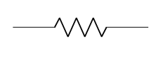
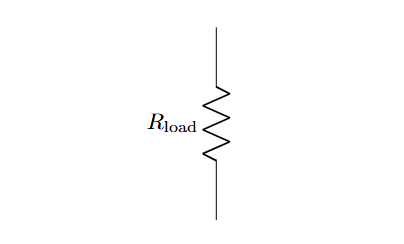
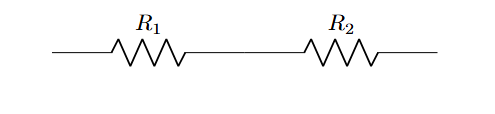
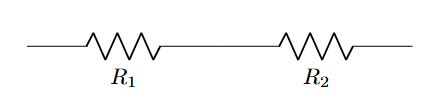

# Lesson 1: Introduction to LaTeX and Circuitikz in Overleaf

## 1. Introduction
**Circuitikz** is a powerful LaTeX package used by Electrical Engineers to create professional, publication-quality circuit diagrams. Unlike drag-and-drop tools, Circuitikz uses code to define components, ensuring perfect alignment and standard symbols.

## 2. Basic Structure
Every circuit drawing requires a specific setup in the LaTeX preamble.

### The Skeleton Code
```latex
\documentclass{article}
\usepackage{circuitikz} % Essential package for circuits

\begin{document}
    \begin{circuitikz}
        % Drawing commands go here
    \end{circuitikz}
\end{document}
```

## 3. The `\draw` Command
The fundamental command to place components is `\draw`. It works on a Cartesian coordinate system (x, y).

Syntax:  
```latex
\draw (starting_point) to[component_type, label] (ending_point);
```   

Key Rules:  
- Coordinates: Defined as `(x,y)`. E.g., (0,0).
- The Connector: The keyword to connects two coordinates.
- The Component: Inside square brackets `[...]`. E.g., [R] for Resistor.
- The Semicolon: Every path must end with `;`. 

## Draws a resistor horizontally from x=0 to x=3:

```Latex
\begin{circuitikz}
    \draw (0,0) to[R, l=$R_1$] (3,0);
\end{circuitikz} 
```

Explanation:  
- R: Specifies the component is a Resistor.
- l=`$R_1$`: Adds a label above the component. The `$` signs are used for mathematical formatting (italics, subscripts).  


```latex
\documentclass{article} % The type of document

% The Preamble
\usepackage{circuitikz} % We are importing the circuit tool

\begin{document}

    % The Drawing Area
    \begin{center}
        \begin{circuitikz}
            % This draws a wire from (0,0) to (2,0) with a Resistor in the middle
            \draw (0,0) to[R] (3,0); 
        \end{circuitikz}
    \end{center}

\end{document}
```

Output:  

<p align="center">
  
</p>


If you want to name the resistor:  
```latex
\draw (0,0) to[R, l=$R_1$] (3,0);
```
-----

## Draw a straight wire (without a resistor) from (0,0) to (4,0):
Method-1:  
```latex
\begin{circuitikz}
  \draw (0,0) -- (4,0);
\end{circuitikz}
```

🔍 Explanation:

- -- → draws a plain wire

- (0,0) → starting point

- (4,0) → ending point

Method-2: (Recommended)   
```latex
\begin{circuitikz}
  \draw (0,0) to[short] (4,0);
\end{circuitikz}
```

Output:  

<p align="center">
  
</p>

## The Vertical Resistor:

```latex
\begin{circuitikz}
  \draw (0,0) to[R, l=$R_{\rm load}$] (0,3);
\end{circuitikz}
```

Explanation:  
- R_ → creates a subscript for R
- `{\rm load}` → typesets the subscript text in upright (roman) font instead of italic


Output:  

<p align="center">
  
</p>


## Two Resistors in Series
```latex
\begin{circuitikz}
    % First resistor R1 from (0,0) to (3,0)
    \draw (0,0) to[R, l=$R_1$] (3,0);

    % Second resistor R2 from (3,0) to (6,0)
    \draw (3,0) to[R, l=$R_2$] (6,0);
\end{circuitikz}
```

Output:  

<p align="center">
  
</p>


If you want the labels under the resistors:
```latex
\begin{circuitikz}
    \draw (0,0) to[R, l_=$R_1$] (3,0);
    \draw (3,0) to[R, l_=$R_2$] (6,0);
\end{circuitikz}
```

Output:  

<p align="center">
  
</p>

