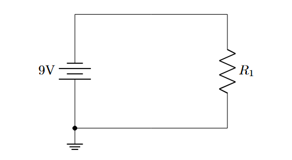

# Lesson 3: Voltage Sources, Grounds, and Nodes


## 1. Voltage Sources
To power our circuits, we use voltage sources.

| Component | Code | Description |
| :--- | :--- | :--- |
| **DC Source** | `to[V, l=5V]` | Generic circle with +/- |
| **Battery** | `to[battery, l=9V]` | Standard battery symbol |
| **Battery (Alt)**| `to[battery1]` | Alternative style |

## 2. Grounding
Ground is a specific node shape in Circuitikz. It is typically attached to the end of a wire or a specific coordinate.

**Syntax:**
```latex
\draw (x,y) node[ground]{};
```


# 3. Connection Nodes
To show that wires are electrically connected (and not just crossing), we use filled circles (nodes).  
### Method A: The Suffix (Recommended):
You can add specific line-ending styles to component options.  
- `to[short, -*]`: Line ends with a dot.
- `to[short, *-]`: Line starts with a dot.
- `to[short, *-*]`: Dots at both ends.
- `to[short, -o]`: Ends with an open circle (terminal).  

### Method B: The Explicit Node
Place a node manually at a coordinate.
```latex
\draw (2,2) node[circ]{};  % Solid black dot
\draw (2,2) node[ocirc]{}; % Open white circle
```

-------
## Example:  
```latex
\documentclass{article}
\usepackage{circuitikz}

\begin{document}

\begin{center}
\begin{circuitikz}

    % Voltage source
    \draw (0,0) to[battery, l=9V] (0,3);

    % Top wire
    \draw (0,3) to[short] (4,3);

    % Resistor
    \draw (4,3) to[R, l=$R_1$] (4,0);

    % Node at (0,0)
    \draw (0,0) node[circ]{}; 

    % ground
    \draw (4,0) to[short] (0,0) node[ground]{};

\end{circuitikz}
\end{center}

\end{document}
```


Output:  

<p align="center">
  
</p>