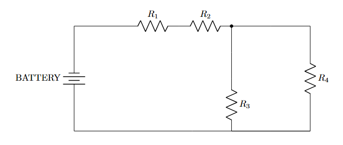
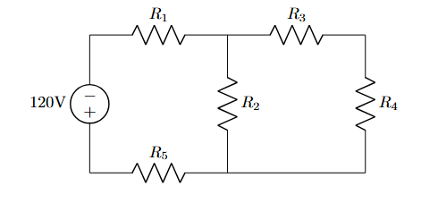
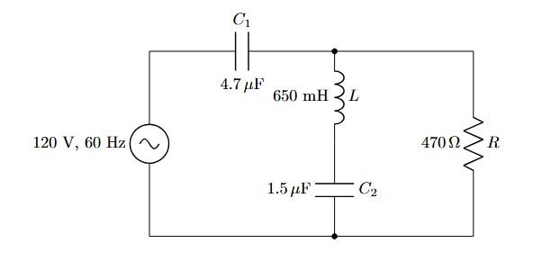

# Lesson-5: Series–Parallel Circuit Examples

## Example-1:

```latex
\documentclass{article}
\usepackage{circuitikz}

\begin{document}

\begin{center}
\begin{circuitikz}[american]

% Battery
\draw (0,0) to[battery, l=BATTERY] (0,4);

% Series resistors R1 and R2
\draw (0,4) -- (2,4)
      to[R, l=$R_1$] (4,4)
      to[R, l=$R_2$] (6,4);

% Junction node
\draw (6,4) node[circ] {};

% Parallel branches
\draw (6,4) to[short] (6,2)
      to[R, l=$R_3$] (6,0);

\draw (6,4) to[short] (9,4)
      to[R, l=$R_4$] (9,0);

% Bottom return path
\draw (6,0) to[short] (9,0)
      to[short] (0,0);

\end{circuitikz}
\end{center}

\end{document}
```

Output:  

<p align="center">
  
</p>

### To invert the battery:  
```latex
% Battery
\draw (0,0) to[battery, invert, l=9V] (0,4);
```

## Example-2: 
```latex
\documentclass{article}
\usepackage{circuitikz}

\begin{document}
    \begin{center}
        \begin{circuitikz}[american]
            
            % --- PART 1: LEFT SIDE ---
            % Source E
            \draw (0,0) to[V, l=120V] (0,3);
            
            % Top Resistor R1
            \draw (0,3) to[R, l=$R_1$] (3,3);
            
            % Middle Resistor R2 (Vertical)
            \draw (3,3) to[R, l=$R_2$] (3,0);
            
            % Bottom Resistor R5
            % Draw left-to-right to keep text readable
            \draw (0,0) to[R, l=$R_5$] (3,0);


            % --- PART 2: RIGHT SIDE ---
            % Top Resistor R3
            \draw (3,3) to[R, l=$R_3$] (6,3);
            
            % Right Resistor R4 (Vertical)
            \draw (6,3) to[R, l=$R_4$] (6,0);
            
            % Closing the loop at the bottom right
            \draw (6,0) -- (3,0);

        \end{circuitikz}
    \end{center}
\end{document}
```

Output:  

<p align="center">
  
</p>


## Example-3:

```latex
\documentclass{article}
\usepackage{circuitikz}

\begin{document}
    \begin{center}
        \begin{circuitikz}[american]
            
            % 1. The AC Voltage Source (Left)
            % sV = Sinusoidal Voltage
            \draw (0,0) to[sV, l={120 V, 60 Hz}] (0,4);

            % 2. Top Capacitor C1
            % l = Label (Top), a = Annotation (Bottom)
            \draw (0,4) to[C, l=$C_1$, a=$4.7\,\mu$F] (4,4);

            % 3. Middle Branch (Inductor L + Capacitor C2)
            % We draw from top (4,4) down to (4,0)
            % "*-*" adds connection dots at start and end
            \draw (4,4) to[L, l=$L$, a=$650$ mH, *-] (4,2)
                        to[C, l=$C_2$, a=$1.5\,\mu$F, -*] (4,0);

            % 4. Right Branch (Resistor R)
            \draw (4,4) -- (7,4) % Wire to the right
                        to[R, l=$R$, a=$470\,\Omega$] (7,0) % Resistor down
                        -- (0,0); % Bottom wire back to start

        \end{circuitikz}
    \end{center}
\end{document}
```

Output:  

<p align="center">
  
</p>

