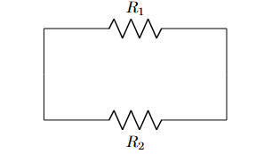
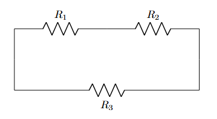

# Lesson-4: Series-Parallel Connection

## ✅Two Resistors in Series
```latex
\documentclass{article}
\usepackage{circuitikz}

\begin{document}

\begin{center}
\begin{circuitikz}
    % First resistor R1 from (0,0) to (3,0)
    \draw (0,0) to[R, l=$R_1$] (3,0);

    % Second resistor R2 from (3,0) to (6,0)
    \draw (3,0) to[R, l=$R_2$] (6,0);
\end{circuitikz}
\end{center}

\end{document}
```

Output:  

<p align="center">
  
</p>


If you want the labels under the resistors:
```latex
\begin{circuitikz}
    \draw (0,0) to[R, l_=$R_1$] (3,0);
    \draw (3,0) to[R, l_=$R_2$] (6,0);
\end{circuitikz}
```

Output:  

<p align="center">
  
</p>

Explanation:  
- `l_` = places the label below the resistor
- Useful if top space is crowded in your diagram


## ✅Two Resistors in Parallel


```latex
\documentclass{article}
\usepackage{circuitikz}

\begin{document}

\begin{center}
\begin{circuitikz}
    % Left node
    \draw (0,0) to[short] (0,-2);

    % Top resistor
    \draw (0,0) to[R, l=$R_1$] (4,0);

    % Bottom resistor
    \draw (0,-2) to[R, l_=$R_2$] (4,-2);

    % Right node
    \draw (4,0) to[short] (4,-2);
\end{circuitikz}
\end{center}

\end{document}
```
Output:  

<p align="center">
  
</p>


## ✅Series–Parallel Resistor Connection

```latex
\documentclass{article}
\usepackage{circuitikz}

\begin{document}

\begin{center}
\begin{circuitikz}

    % Left node
    \draw (0,0) to[short] (0,-2);

    % Series branch (top)
    \draw (0,0) to[R, l=$R_1$] (3,0)
              to[R, l=$R_2$] (6,0);

    % Parallel branch (bottom)
    \draw (0,-2) to[R, l_=$R_3$] (6,-2);

    % Right node
    \draw (6,0) to[short] (6,-2);

\end{circuitikz}
\end{center}

\end{document}
```
Output:  

<p align="center">
  
</p>
